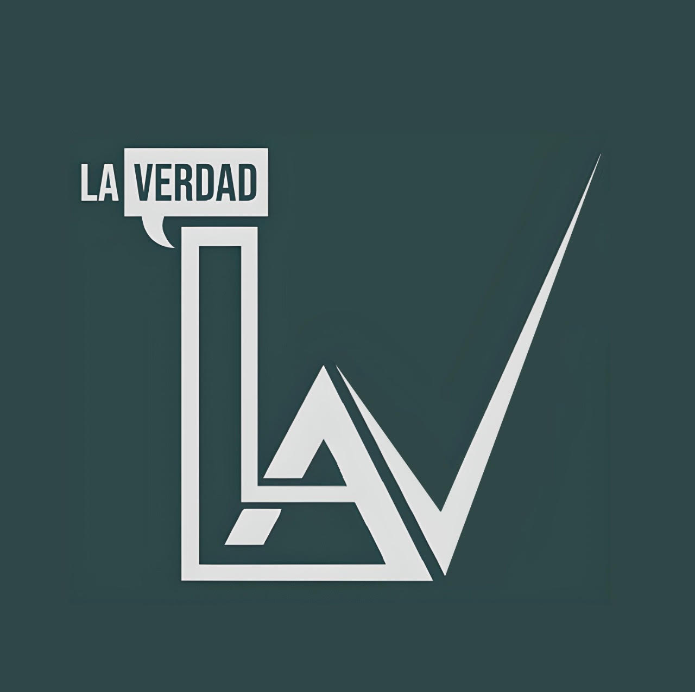

# La Verdad, Publisher(Blog)

> Grimoldi, Joaquín

## Resumen

+ La Verdad es una página de noticias, con diseño responsivo para todos los dispositivos. 
  
+ Un sitio web realizado con PHP, de blogs totalmente autentificado y que se actualice dinámicamente para crear posts que compartan pensamientos, ideas y experiencias.

+ Secciones:
  1. Noticias;
  2. Búsquedas;
  3. Empleos.

+ Área de administración y área pública.
  
+ El área de administración solo es accesible para los administradores registrados y el área publica solo para usuarios.

+ **Administradores:**
  1. Pueden crear, ver, publicar, actualizar y borrar noticias.
  2. Pueden crear y borrar temas.
  3. Pueden crear o eliminar otros usuarios.
   
+ **Autores:**
  1. Pueden crear y ver noticias.

+ Cada publicación se crea bajo un tema.
  
+ Página moderna con colores actualizados

+ **Tecnologías:** HTML5, CSS3, JS ES6, PHP, MYSQL

## Summary

+ La Verdad is a news site, with responsive design for all devices. 
  
+ A website made with PHP, fully authenticated blogging and dynamically updated to create posts that share thoughts, ideas and experiences.

+ **Sections:**
  1. News;
  2. Search;
  3. Jobs.

+ Administration area and public area.
  
+ The administration area is only accessible for registered administrators and the public area only for users.

+ **Administrators:**
  1. They can create, view, publish, update and delete news.
  2. They can create and delete topics.
  3. They can create or delete other users.
   
+ **Authors:**
  1. They can create and view news.

+ Each publication is created under a topic.
  
+ Modern page with updated colors.

+ **Technologies:** HTML5, CSS3, JS ES6, PHP, MYSQL

## WebSite

---

## Web Features / Características de la Web

### General

+

### Mobile / Celular

+ 

### Desktop / Escritorio

+